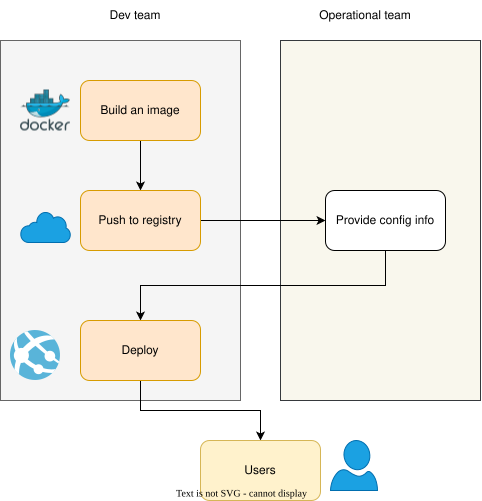
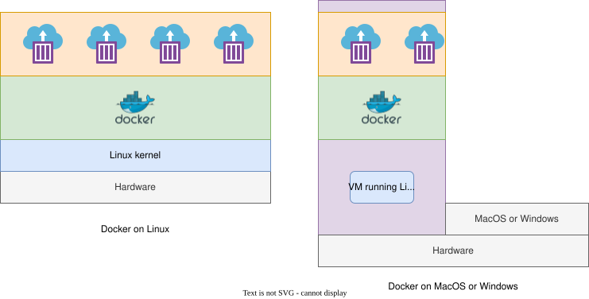

Docker is a tool which can easily encapsulate the process of creating a distributable artifact for any application, deploying it at scale into any environment.

## Why Docker?

- Decreasing the gap between the developer team and packaging and distribution team.
- Resolving dependencies of applications easily; bundling application software and required OS filesystems together in a single
standardized image format.



## VM vs Containers

Virtual machines are typically used for creating an virtualized layer (also known as hypervisor) between the physical hardware and the software applications that run on it. This approach provides very strong isolation between workloads and each VM hosts its own operating system kernel which is located in separate memory space.

> Remember that the hypervisors that manage the VMs and each VM’s running kernel use a percentage of the hardware system’s resources, which are then no longer available to the hosted applications.

A container, on the other hand, is just another process that typically talks directly to the underlying Linux kernel and therefore can utilize more resources, up until the system or quota-based limits are reached. In other words, Linux containers are very lightweight wrappers around a single Unix process. This process can spawn other processes. The libcontainer README provides following definition of a container:

> A container is a self-contained execution environment that shares the kernel of the host system and is (optionally) isolated from other containers in the system.

## Docker Architecture

Docker is a powerful technology, and under the hood it contains tools and processes that come with a high level of complexity.
However, its client/server model hides most of the complexity from the user and makes things very simple for the users.

In this way, although, several components are involved in the Docker API, including `containerd` and `runc`, but the basic system interaction is a client talking over an API to a server.

In this way docker has two parts:

1. docker client
2. dockerd server/daemon

- The server does most of the work such as building, running, and managing our containers.
- We just use the client to tell the server what to do.
- The Docker daemon can run on any number of servers in the infrastructure, and a single client can address any number of servers
- Clients drive all of the communication, but Docker servers can talk directly to image registries when told to do so by the client.

> In summary, clients are responsible for telling servers what to do, and servers focus on hosting and managing containerized applications.



### Docker on Linux host

Docker has traditionally been developed on the Ubuntu Linux distribution, but most Linux distributions and other major operating systems are now supported where possible.

> Red Hat has gone all in on containers, and all of its platforms have first-class support for Docker. With the near-ubiquity of containers in the Linux realm, we now have distributions like Red Hat’s Fedora CoreOS, which is built entirely for Linux container workloads.

### Docker on MacOS and Windows

Docker has released easy-to-use implementations for macOS and Windows. Although, these appear to run natively but are still utilizing a small Linux virtual machine to provide the Docker server and Linux kernel.

When we install docker on MacOS and Windows, a Linux virtual machine is also installed. Docker daemon (dockerd) runs on this Linux (VM) host.

## Docker client

`docker` command is the client, which can talk to the server and docker repository.

The docker client is a Go program, which works on most major operating systems, and the server can run on Linux and Windows server.

## Docker server

`dockerd` command is used for starting the Docker server. Server does all the tasks instructed by the client.

The Docker server is a separate binary from the client and is used to manage most of the work for which Docker is typically used. Next we will explore the most common ways to manage the Docker server.

## Docker images

- Docker and OCI images consist of one or more filesystem layers and some important metadata that represent all the files required to run a containerized application.
- A single image can be copied to numerous hosts.
- An image typically has a repository address, a name, and a tag.
- The tag is generally used to identify a particular release of an image.
- An image can specify environment variables and arguments, which can be set by users for creating several containers from the same image.

## Linux container

- This is a container that has been instantiated from a Docker image.
- A specific container can exist only once; however, you can easily create multiple containers from the same image.
- The term Docker container is a misnomer since Docker simply leverages the operating system’s container functionality.

## Atomic or mutable hosts

An atomic or immutable host is a small, finely tuned OS image, like Fedora CoreOS, that supports container hosting and atomic OS upgrades.

## Further readings on containers

- [Fedora project](https://fedoraproject.org/en/coreos/)
- [Microsoft hyper-v](https://learn.microsoft.com/en-us/virtualization/hyper-v-on-windows/about/)

## Docker images

- To launch a container, we must either download a public image or create your own.
- The docker image can be considered as a single asset that mainly represents the filesystem for the container.
- Docker images are built up from individual layers. Each layer puts a special demands on the Linux kernel

## Anatomy of a Dockerfile

A typical Docker image running the node application looks like the following.

```dockerfile
FROM alpine:3.18
USER root
ENV EASIFEM_BUILD_DIR /easifem/build
ENV EASIFEM_SOURCE_DIR /easifem/src
ENV EASIFEM_INSTALL_DIR /easifem/install
ENV EASIFEM_TEST_DIR /easifem/tests

RUN apk update && apk add --no-cache gfortran musl-dev

COPY ./tests/* $EASIFEM_TEST_DIR/

WORKDIR $EASIFEM_TEST_DIR

RUN gfortran -o main.out main.F90 && ./main.out

ARG email="vickysharma0812@gmail.com"
LABEL "maintainer"=$email
```

Let understand the above file line by line.

```bash
FROM alpine:3.18
```

This line indicates the base image for our image. In this case it is Alpine linux version3.18. You can read about this project [here](https://hub.docker.com/_/alpine).

> Alpine Linux is a Linux distribution built around musl libc and BusyBox. The image is only 5 MB in size and has access to a package repository that is much more complete than other BusyBox based images. This makes Alpine Linux a great image base for utilities and even production applications. Read more about Alpine Linux here and you can see how their mantra fits in right at home with Docker images.

```bash
ARG email="vickysharma0812@gmail.com"
```

This line defines an argument (a variable) in the Dockerfile. This variable can be specified by the user while running the container.

```bash
LABEL "maintainer"=$email
```

This line defines a label for the image that we are building.

> Applying labels to images and containers allows us to add metadata via key/value pairs that can later be used to search for and identify Docker images and containers.

```bash
USER root
```

By default, Docker runs all processes as root within the container, the above line describes the USER.

> Even though containers provide some isolation from the underlying operating system, they still run on the host kernel. Due to potential security risks, production containers should almost always be run in the context of an unprivileged user.

```bash
ENV EASIFEM_BUILD_DIR /easifem/build
ENV EASIFEM_SOURCE_DIR /easifem/src
ENV EASIFEM_INSTALL_DIR /easifem/install
ENV EASIFEM_TEST_DIR /easifem/tests
```

The above lines define the shell environment variables.

```bash
RUN apk update && apk add --no-cache gfortran musl-dev
```

The above lines run the commands. Here, it is worth remembering that every instruction creates a new Docker image layer, so it often makes sense to combine a few logically grouped commands onto a single line.

```bash
COPY ./tests/* $EASIFEM_TEST_DIR/
```

This command moves the file from the `tests` directory of host to `/easifem/tests/` directory of the image.

```bash
WORKDIR $EASIFEM_TEST_DIR
```

With the WORKDIR instruction, we can change the working directory in the image for
the remaining build instructions.

> The order of commands in a Dockerfile can have a very significant impact on ongoing build times. You should try to order commands so that things that change between every single build are closer to the bottom. This means that adding your code and similar steps should be held off until the end. When you rebuild an image, every single layer after the first introduced change will need to be rebuilt.

## Building an image

Before we build the image, we need to add `.dockerignore` file to the same location as `Dockerfile`. Add following entries to it.

```bash
.git
*.out
*.o
build
*/build/*
```

To build the image run the following command:

```bash
docker image build -t  vickysharma0812/fortran-hello-world-alpine:latest
```

> Using `docker image build` is functionally the same as using `docker build`.

To improve the speed of builds, Docker will use a local cache when it thinks it is safe. This can sometimes lead to unexpected issues because it doesn’t always notice that something changed in a lower layer. You can disable the cache for a build by using the `--no-cache` argument to the docker image build command.

Each step identified in the following output maps directly to a line in the Dockerfile, and each step creates a new image layer based on the previous step.  The first build that you run will take a few minutes because you have to download the base node image. Subsequent builds should be much faster unless a new version of our base image tag has been released.

## Running Image

We run the above image by using following command.

```bash
docker container run --rm -d vickysharma0812/fortran-hello-world-alpine:latest
```

## Setting environment variables

While running the container, we can set the environment variables by using `--env` or `-e` flag.

```bash
docker container run --rm -d \
--env EASIFEM_SOURCE_DIR=/easifem/source/ \
vickysharma0812/fortran-hello-world-alpine:latest
```

## Storing images on Dockerhub

Create account at [Docker hub](https://hub.docker.com).

- The first step required to push the image is to ensure that you are logged in to the Docker repository you intend to use.

First we need to change the tag of the image that we have build. We need to add the host name `docker.io`.

```bash
docker image tag vickysharma0812/fortran-hello-world-alpine:latest \
    docker.io/vickysharma0812/fortran-hello-world-alpine:latest
```

Here `vickysharma0812` is my account name on `hub.docker.com`.

Now we push this image to docker cloud.

```bash
docker image push vickysharma0812/fortran-hello-world-alpine:latest
```

After that anyone who has access to internet can pull out image and run the containers.

```bash
docker image pull vickysharma0812/fortran-hello-world-alpine:latest
```

## Getting info on build images

We can dive into the build images by using [dive](https://github.com/wagoodman/dive) and using following command.

```bash
dive vickysharma0812/fortran-hello-world-alpine:latest
```

```txt
┃ ● Layers ┣━━━━━━━━━━━━━━━━━━━━━━━━━━━━━━━━━━━━━━━━━━━━━━━━━━━━━━━━━━━━━━━━━━━━━━━━━━━━━━━━━━━━━━━ 
Cmp   Size  Command                                                                                 
    7.7 MB  FROM de8b86e33ae69ac                                                                    
    172 MB  RUN |1 email=vickysharma0812@gmail.com /bin/sh -c apk update && apk add --no-cache gfor 
      71 B  COPY ./tests/* /easifem/tests/ # buildkit                                               
       0 B  WORKDIR /easifem/tests                                                                  
     73 kB  RUN |1 email=vickysharma0812@gmail.com /bin/sh -c gfortran -o main.out main.F90 && ./ma 
                                                                                        
Image name: vickysharma0812/fortran-hello-world-alpine:latest                                       
Total Image size: 179 MB                                                                           
Potential wasted space: 1.5 MB                                                                     
Image efficiency score: 99 %                                                                       
                                                                                                    
Count   Total Space  Path                                                                           
    2        1.3 MB  /lib/ld-musl-aarch64.so.1                                                      
    2         94 kB  /lib/apk/db/installed                                                          
    2         68 kB  /usr/bin/strings                                                               
    2         22 kB  /lib/apk/db/scripts.tar                                                        
    2         152 B  /lib/apk/db/triggers
```

As you can see, most of the space in our image is taken by `gfortran` and `gcc` compilers.

## Multistage builds

> Multi-stage builds are useful to optimize Dockerfiles while keeping them easy to read and maintain.

By using [multistage](https://docs.docker.com/build/building/multi-stage/) build technique we can reduce the size of our docker image. The key point to is that we do not need to worry much about bringing in extra resources to build our application, and we can still run a lean production container. Multistage containers also encourage doing builds inside Docker, which is a great pattern for repeatability in your build system.

In the past, it was common practice to have one Dockerfile for development, and another, slimmed-down one to use for production. The development version contained everything needed to build your application. The production version only contained your application and the dependencies needed to run it.

To write a truly efficient Dockerfile, you had to come up with shell tricks and arcane solutions to keep the layers as small as possible. All to ensure that each layer contained only the artifacts it needed, and nothing else.

You can read about the [multistage here](https://docs.docker.com/build/building/multi-stage/).

- With multi-stage builds, we can use multiple `FROM` statements in the Dockerfile.
- Each `FROM` instruction can use a different base, and each of them begins a new stage of the build.
- `You` can selectively copy artifacts from one stage to another, leaving behind everything you don’t want in the final image.

```dockerfile
# syntax=docker/dockerfile:1
FROM ubuntu:22.04 as system_builder
USER root
RUN apt-get update && \
apt-get install -y --no-install-recommends gfortran gcc libomp-dev curl git \
python3 python3-pip cmake ninja-build \
liblapack-dev libopenblas-dev libhdf5-dev \
libplplot-dev plplot-driver-cairo libboost-all-dev \
gnuplot doxygen libgtk-4-dev && apt-get clean

FROM system_builder
ENV EASIFEM_BUILD_DIR /easifem/build
ENV EASIFEM_SOURCE_DIR /easifem/src
ENV EASIFEM_INSTALL_DIR /easifem/install
ENV EASIFEM_TEST_DIR /easifem/tests

COPY ./tests/* $EASIFEM_TEST_DIR/

WORKDIR $EASIFEM_TEST_DIR

RUN gfortran -o main.out main.F90 && ./main.out
```

The first line

```dockerfile
# syntax=docker/dockerfile:1
```

tells Docker that we are going to use a newer version of the Dockerfile frontend which will require BuildKit's new features.

We can stop the build at particular stage. For example, in the following example, we stop only build the `system_builder` image.

```bash
DOCKER_BUILDKIT=1 docker image build --target system_builder -t vickysharma0812/easifem-system:latest .
```

> Note that we have enable `BuiltKit` by specifying `DOCKER_BUILDKIT=1`.

In the line

```dockerfile
FROM system_builder
```

we are using previous stage as new stage.

You can read more about multistage build at official website of [docker](https://docs.docker.com/build/building/multi-stage/).

## Directory caching

The `BuildKit` plugin provides the option for directory caching, which is an incredibly useful tool for speeding up build times without saving a lot of files that are unnecessary for the runtime into your image. It allows us to save the contents of a directory inside the image in a special layer that can be bind-mounted at build time and then unmounted before the image snapshot is made. This is often used to handle directories where tools like Linux software installers (apt, apk, dnf, etc.), and language dependency managers (npm, bundler, pip, etc.), download their databases and archive files.

The docker file is given below:

```Dockerfile
# syntax=docker/dockerfile:1
FROM ubuntu:22.04 as system_builder
USER root
RUN --mount=type=cache,target=/root/.cache apt-get update && \
apt-get install -y --no-install-recommends gfortran gcc libomp-dev curl git \
python3 python3-pip cmake ninja-build \
liblapack-dev libopenblas-dev libhdf5-dev \
libplplot-dev plplot-driver-cairo libboost-all-dev \
gnuplot doxygen libgtk-4-dev && apt-get clean

FROM system_builder
ENV EASIFEM_BUILD_DIR /easifem/build
ENV EASIFEM_SOURCE_DIR /easifem/src
ENV EASIFEM_INSTALL_DIR /easifem/install
ENV EASIFEM_TEST_DIR /easifem/tests

COPY ./tests/* $EASIFEM_TEST_DIR/

WORKDIR $EASIFEM_TEST_DIR

RUN gfortran -o main.out main.F90 && ./main.out
```

By using

```dockerfile
RUN --mount=type=cache,target=/root/.cache apt-get update && \
```

we tell BuildKit to mount a caching layer into the container at `/root/.cache` for the duration of this build step. In this way, we remove the contents of `.cache` directory from the resulting image, and it will be remounted and available to `apt-get` in consecutive builds.

## Creating a container

When we call

```bash
docker container run
```

It performs two tasks:

- Creating container
- Starting the container

We can create container by

```bash
docker container create
```

We can start container by

```bash
docker container start
```

When we create container from an image, we can specify its configuration. It means we can specify the evironment variables, arguments, name, etc.

Understanding the command run command:

```bash
docker container run --rm -it ubuntu:latest /bin/bash
```

- `--rm` this option tells docker to delete the container when it exits.
- `-i` option tells docker that the current session will be interactive and that we want to keep STDIN open.
- `-t` option tells docker to allocate a pseudo-TTY

## Container configuration

### Name

To give a container name use

```bash
docker container create --name="my-cool-container" ubuntu:latest
```

### Labels

Lables are keyvalue pairs in Dockerfile (image).

We can specify label by using option flag `-l` or `--label`.

```bash
docker container run --rm -d --name="container-with-label" \
-l deployer=Vikas -l tester=Vikas \
ubuntu:latest
```

### Hostname

By default the hostname is same as the container id.

We can set the hostname by

```bash
docker container run --rm --it \
--hostname="mycontainer" ubuntu:latest /bin/bash
```

### Domain Name Server

TODO

### Storage volumes

When the default disk space allocated to a container is not appropriate for the job at hand, In these cases we need storage that can persist between container deployments.

In such case we use `--mount` or `-v` option. For example,

```bash
docker container run --rm --it \
--mount=type=bind,target=/mnt/session_data,source=/data \
ubuntu:latest /bin/bash
```

- When you use a bind mount, a file or directory on the host machine is mounted into a container.
- The file or directory is referenced by its absolute path on the host machine.
- Neither the host mount point nor the mount point in the container needs to preexist for this command to work properly. If the host mount point does not exists, then it will be created as a directory.

You can read more about the [bind mount here](https://docs.docker.com/storage/bind-mounts/).

When the default disk space allocated to a container is not appropriate for the job at hand, In these cases we need storage that can persist between container deployments.

In such case we use `--mount` or `-v` option.

## Volumes

Volumes are the preferred mechanism for persisting data generated by and used by Docker containers.

While bind mounts are dependent on the directory structure and OS of the host machine, volumes are completely managed by Docker.

Volumes have several advantages over bind mounts:

- Volumes are easier to back up or migrate than bind mounts.
- You can manage volumes using Docker CLI commands or the Docker API.
- Volumes work on both Linux and Windows containers.
- Volumes can be more safely shared among multiple containers.
- Volume drivers let you store volumes on remote hosts or cloud providers, to encrypt the contents of volumes, or to add other functionality.
- New volumes can have their content pre-populated by a container.
- Volumes on Docker Desktop have much higher performance than bind mounts from Mac and Windows hosts.

In addition, volumes are often a better choice than persisting data in a container’s writable layer, because a volume doesn’t increase the size of the containers using it, and the volume’s contents exist outside the lifecycle of a given container.

If your container generates non-persistent state data, consider using a tmpfs mount to avoid storing the data anywhere permanently, and to increase the container’s performance by avoiding writing into the container’s writable layer.

We can specify the volume by using `--volume` or `-v` option.

- This option consists of three fields, separated by colon characters `(:)`. The fields must be in the correct order, and the meaning of each field isn’t immediately obvious.
- In the case of named volumes, the first field is the name of the volume, and is unique on a given host machine. For anonymous volumes, the first field is omitted.
- The second field is the path where the file or directory are mounted in the container.
- The third field is optional, and is a comma-separated list of options, such as `ro`.

```bash
docker container run --rm -it --name alpine_linux --volume "$(pwd)"/tests:/tests ubuntu:latest /bin/bash
```

Read only:

```bash
docker container run --rm -it --name alpine_linux --volume "$(pwd)"/tests:/tests:ro ubuntu:latest /bin/bash
```

## Backing up data

```bash
docker run -v /dbdata --name dbstore ubuntu /bin/bash
```

In the next command:

- Launch a new container and mount the volume from the dbstore container
- Mount a local host directory as /backup
- Pass a command that tars the contents of the dbdata volume to a backup.tar file inside our /backup directory.

```bash
docker run --rm --volumes-from dbstore -v $(pwd):/backup ubuntu tar cvf /backup/backup.tar /dbdata
```

When the command completes and the container stops, it creates a backup of the dbdata volume.

See [how to restore volume from backup](https://docs.docker.com/storage/volumes/#restore-volume-from-a-backup)

## Removing volumes

A Docker data volume persists after you delete a container. There are two types of volumes to consider:

- Named volumes have a specific source from outside the container, for example, awesome:/bar.
- Anonymous volumes have no specific source. Therefore, when the container is deleted, you can instruct the Docker Engine daemon to remove them.

To automatically remove anonymous volumes, use the `--rm` option. For example, this command creates an anonymous `/foo` volume. When you remove the container, the Docker Engine removes the `/foo` volume but not the awesome volume.

```bash
docker run --rm -v /foo -v awesome:/bar busybox top
```

> If another container binds the volumes with `--volumes-from`, the volume definitions are copied and the anonymous volume also stays after the first container is removed.

To remove all unused volumes and free up space:

```bash
docker volume prune
```

When the default disk space allocated to a container is not appropriate for the job at hand, In these cases we need storage that can persist between container deployments.

In such case we use `--mount` or `-v` option.

## Volumes

Volumes are the preferred mechanism for persisting data generated by and used by Docker containers.

While bind mounts are dependent on the directory structure and OS of the host machine, volumes are completely managed by Docker.

Volumes have several advantages over bind mounts:

- Volumes are easier to back up or migrate than bind mounts.
- You can manage volumes using Docker CLI commands or the Docker API.
- Volumes work on both Linux and Windows containers.
- Volumes can be more safely shared among multiple containers.
- Volume drivers let you store volumes on remote hosts or cloud providers, to encrypt the contents of volumes, or to add other functionality.
- New volumes can have their content pre-populated by a container.
- Volumes on Docker Desktop have much higher performance than bind mounts from Mac and Windows hosts.

In addition, volumes are often a better choice than persisting data in a container’s writable layer, because a volume doesn’t increase the size of the containers using it, and the volume’s contents exist outside the lifecycle of a given container.

If your container generates non-persistent state data, consider using a tmpfs mount to avoid storing the data anywhere permanently, and to increase the container’s performance by avoiding writing into the container’s writable layer.

We can specify the volume by using `--volume` or `-v` option.

- This option consists of three fields, separated by colon characters `(:)`. The fields must be in the correct order, and the meaning of each field isn’t immediately obvious.
- In the case of named volumes, the first field is the name of the volume, and is unique on a given host machine. For anonymous volumes, the first field is omitted.
- The second field is the path where the file or directory are mounted in the container.
- The third field is optional, and is a comma-separated list of options, such as `ro`.

## Bind mounts

```bash
docker container run --rm --it \
--mount=type=bind,target=/mnt/session_data,source=/data \
ubuntu:latest /bin/bash
```

- When you use a bind mount, a file or directory on the host machine is mounted into a container.
- The file or directory is referenced by its absolute path on the host machine.
- Neither the host mount point nor the mount point in the container needs to preexist for this command to work properly. If the host mount point does not exists, then it will be created as a directory.

You can read more about the [bind mount here](https://docs.docker.com/storage/bind-mounts/).

According to official [website](https://docs.docker.com/storage/bind-mounts/):

> New users should use the `--mount` syntax. Experienced users may be more familiar with the `-v` or `--volume` syntax, but are encouraged to use `--mount`, because research has shown it to be easier to use.

- `--mount`: Consists of multiple key-value pairs, separated by commas and each consisting of a `<key>=<value>` tuple.
- The `source` of the mount. For bind mounts, this is the path to the file or directory on the Docker daemon host. May be specified as `source` or `src`.
- The `destination` takes as its value the path where the file or directory is mounted in the container. May be specified as `destination`, `dst`, or `target`.
- The `readonly` option, if present, causes the bind mount to be mounted into the container as read-only.
- The `bind-propagation` option, if present, changes the bind propagation. May be one of `rprivate`, `private`, `rshared`, `shared`, `rslave`, `slave`.
- The --mount flag does not support z or Z options for modifying selinux labels.

> - If you use `--mount` to bind-mount a file or directory that does not yet exist on the Docker host, Docker does not automatically create it for you, but generates an error.
> - Use `docker inspect <container_name>` to verify that the bind mount was created correctly.
> - If you `bind-mount` a directory into a non-empty directory on the container, the directory’s existing contents are obscured by the bind mount. This can be beneficial, such as when you want to test a new version of your application without building a new image. However, it can also be surprising and this behavior differs from that of docker volumes.

By default `bind-mount` has read and write permission, but we can give the mount location read only access.

```bash
docker run -d \
  -it \
  --name devtest \
  --mount type=bind,source="$(pwd)"/target,target=/app,readonly \
  nginx:latest
```
