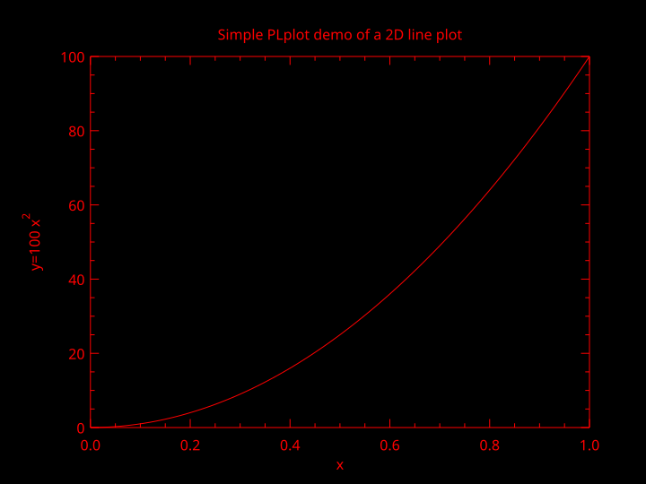

## Introduction

PLplot is a software package for creating scientific plots . It is cross-platform ❤, which means it will work on Windows, Unix, and Linux system. The PLplot software is primarily licensed under [the LGPL](http://www.gnu.org/licenses/lgpl.html) 🔥. It is written in C language, and it has [bindings](http://plplot.sourceforge.net/index.php#bindings) 🔗 for several other language including Fortran 🖥️ .

The PLplot core library can be used to create

- 💥standard x-y plots
- 🔥semi-log plots
- 🚀log-log plots
- 🌤contour plots
- 🌹3D surface plots
- 🌩mesh plots
- 🦁bar charts
- 🥧pie charts.

You can find more about PLPLOT [➡️🖱](http://plplot.sourceforge.net/index.php)

## Historical remark

A small history of PLPLOT taken from the [official documentation](http://plplot.sourceforge.net/docbook-manual/plplot-html-5.15.0/plplot-plotting-library.html) is given below.

PLplot was originally developed by **Sze Tan** of the _University of Auckland_ in **Fortran-77**. Many of the underlying concepts used in the PLplot package are based on ideas used in Tim Pearson's PGPLOT package. Sze Tan writes:

> I'm rather amazed how far PLPLOT has travelled given its origins etc. I first used PGPLOT on the Starlink VAX computers while I was a graduate student at the Mullard Radio Astronomy Observatory in Cambridge from 1983-1987. At the beginning of 1986, I was to give a seminar within the department at which I wanted to have a computer graphics demonstration on an IBM PC which was connected to a completely non-standard graphics card. Having about a week to do this and not having any drivers for the card, I started from the back end and designed PLPLOT to be such that one only needed to be able to draw a line or a dot on the screen in order to do arbitrary graphics. The application programmer's interface was made as similar as possible to PGPLOT so that I could easily port my programs from the VAX to the PC. The kernel of PLPLOT was modelled on PGPLOT but the code is not derived from it.

The C version of PLplot was originally developed by **Tony Richardson** on a Commodore Amiga. That version has been improved and expanded ever since first by **Geoffrey Furnish** and **Maurice Lebrun** in the 1990's and later (after the project was registered at SourceForge on 2000-02-23) [with a much-expanded development team.](http://plplot.org/credits.php)

## Installation of binary packages

Ubuntu 🍻

```bash
sudo apt-get install libplplot-dev libplplotfortran0
```

MacOS 🍎

```bash
brew install plplot
```

## Building from source

### Download the source code

```bash
git clone https://git.code.sf.net/p/plplot/plplot plplot-plplot
```

I have also installed some extra libraries, which are given below.

- `libcairo-dev`
- `libglu1-mesa-dev`
- `freeglut3-dev`
- `mesa-common-dev`
- `pyqt5`
- `pyqt5-tools`

```bash
sudo apt install libcairo-dev libglu1-mesa-dev freeglut3-dev mesa-common-dev
pip3 install pyqt5 pyqt5-tools
```

### Building 🪛

After downloading the source code, run the following command inside of terminal

```bash
cd plplot-plplot
git branch $(whoami)
git checkout $(whoami)
```

We will use `-DCMAKE_INSTALL_PREFIX` to specify the director wherein `PLplot` will be installed.

```sh
cmake -S ./ -B ./build DCMAKE_INSTALL_PREFIX=~/.easifem/extpkgs  -G "Unix Makefiles"
cmake --build ./build --target all
cmake --build ./build --target install
```

**My Configuration:** In my case, I want to install `PLplot` in `~/.easifem/extpkgs`. I have already set an environment variable `export EASIFEM_EXTPKGS=~/.easifem/extpkgs`, so I will use `${EASIFEM_EXTPKGS}`, but you can specify the path explicitly.

- `-DCMAKE_INSTALL_PREFIX:PATH=~/.easifem/extpkgs`
- `-DCMAKE_BUILD_TYPE:STRING=Release`, other option is `Debug`
- `-DBUILD_SHARED_LIBS:BOOL=ON`, set `OFF` if shared lib are not desired
- `-DBUILD_TEST:BOOL=ON`, set `OFF` you dont want to build the tests
- `-DENABLE_fortran:BOOL=ON`, set `OFF`, if you dont want fortran bindings
- `-DENABLE_lua:BOOL=ON`, set `OFF` if you do not want Lua language bindings

```sh
cmake -S ./ -B ~/temp/easifem-extpkgs/plplot/build -G "Unix Makefiles"  -DCMAKE_INSTALL_PREFIX=${EASIFEM_EXTPKGS} -DCMAKE_BUILD_TYPE:STRING=Release -DBUILD_SHARED_LIBS:BOOL=ON  -DBUILD_TEST:BOOL=ON -DENABLE_fortran:BOOL=ON -DENABLE_lua:BOOL=ON

cmake --build ~/temp/easifem-extpkgs/plplot/build --target all
```

Now you can go to `$EASIFEM_EXTPKGS`

```sh
├── bin
├── include/plplot
├── lib
├── man
└── share
```

Contents of `/bin` 📁 is shown below

```sh
/bin
├── plserver
├── pltcl
└── pltek
```

Contents of `/include/plplot` 📁

```sh
├── csadll.h
├── csa.h
├── disptab.h
├── drivers.h
├── pdf.h
├── plConfig.h
├── pldebug.h
├── plDevs.h
├── pldll.h
├── plevent.h
├── plplot.h
├── plplotP.h
├── plstream.h
├── plstrm.h
├── pltcl.h
├── pltk.h
├── plxwd.h
├── qsastimedll.h
├── qsastime.h
├── qt.h
└── tclMatrix.h
```

Contents of `/lib` 📁

```sh
├── cmake
├── fortran
├── libcsirocsa.so -> libcsirocsa.so.0
├── libcsirocsa.so.0 -> libcsirocsa.so.0.0.1
├── libcsirocsa.so.0.0.1
├── libplfortrandemolib.a
├── libplplotcxx.so -> libplplotcxx.so.15
├── libplplotcxx.so.15 -> libplplotcxx.so.15.0.0
├── libplplotcxx.so.15.0.0
├── libplplotfortran.so -> libplplotfortran.so.0
├── libplplotfortran.so.0 -> libplplotfortran.so.0.2.0
├── libplplotfortran.so.0.2.0
├── libplplotqt.so -> libplplotqt.so.2
├── libplplotqt.so.2 -> libplplotqt.so.2.0.3
├── libplplotqt.so.2.0.3
├── libplplot.so -> libplplot.so.17
├── libplplot.so.17 -> libplplot.so.17.0.0
├── libplplot.so.17.0.0
├── libplplottcltk_Main.so -> libplplottcltk_Main.so.1
├── libplplottcltk_Main.so.1 -> libplplottcltk_Main.so.1.0.1
├── libplplottcltk_Main.so.1.0.1
├── libplplottcltk.so -> libplplottcltk.so.14
├── libplplottcltk.so.14 -> libplplottcltk.so.14.1.0
├── libplplottcltk.so.14.1.0
├── libqsastime.so -> libqsastime.so.0
├── libqsastime.so.0 -> libqsastime.so.0.0.1
├── libqsastime.so.0.0.1
├── libtclmatrix.so -> libtclmatrix.so.10
├── libtclmatrix.so.10 -> libtclmatrix.so.10.3.0
├── libtclmatrix.so.10.3.0
├── pkgconfig
└── plplot5.15.0
-plplot5.15.0
└── drivers
    ├── mem.driver_info
    ├── mem.so
    ├── ntk.driver_info
    ├── ntk.so
    ├── null.driver_info
    ├── null.so
    ├── ps.driver_info
    ├── ps.so
    ├── qt.driver_info
    ├── qt.so
    ├── svg.driver_info
    ├── svg.so
    ├── tk.driver_info
    ├── tk.so
    ├── tkwin.driver_info
    ├── tkwin.so
    ├── xfig.driver_info
    ├── xfig.so
    ├── xwin.driver_info
    └── xwin.so
```

The `lib/cmake` directory 📁 contains files necessary for using PLplot with CMake. The contents of this directory are given below.

```sh
├── export_csirocsa.cmake
├── export_csirocsa-release.cmake
├── export_mem.cmake
├── export_mem-release.cmake
├── export_ntk.cmake
├── export_ntk-release.cmake
├── export_null.cmake
├── export_null-release.cmake
├── export_plfortrandemolib.cmake
├── export_plfortrandemolib-release.cmake
├── export_plplot.cmake
├── export_plplotcxx.cmake
├── export_plplotcxx-release.cmake
├── export_plplotfortran.cmake
├── export_plplotfortran-release.cmake
├── export_plplotqt.cmake
├── export_plplotqt-release.cmake
├── export_plplot-release.cmake
├── export_plplottcltk.cmake
├── export_plplottcltk_Main.cmake
├── export_plplottcltk_Main-release.cmake
├── export_plplottcltk-release.cmake
├── export_plserver.cmake
├── export_plserver-release.cmake
├── export_pltcl.cmake
├── export_pltcl-release.cmake
├── export_pltek.cmake
├── export_pltek-release.cmake
├── export_ps.cmake
├── export_ps-release.cmake
├── export_qsastime.cmake
├── export_qsastime-release.cmake
├── export_qt.cmake
├── export_qt-release.cmake
├── export_svg.cmake
├── export_svg-release.cmake
├── export_tclmatrix.cmake
├── export_tclmatrix-release.cmake
├── export_tk.cmake
├── export_tk-release.cmake
├── export_tkwin.cmake
├── export_tkwin-release.cmake
├── export_xfig.cmake
├── export_xfig-release.cmake
├── export_xwin.cmake
├── export_xwin-release.cmake
├── plplotConfig.cmake
├── plplotConfigVersion.cmake
└── plplot_exports.cmake
```

The `lib/pkgconfig` directory contains files necessary for finding PLplot using pkgconfig in CMake projects. The contents of this directory are given below.

```sh
├── plplot-c++.pc
├── plplot-fortran.pc
├── plplot.pc
├── plplot-qt.pc
├── plplot-tcl_Main.pc
└── plplot-tcl.pc
```

The `lib/fortran/modules/plplot` directory contains Fortran module files as shown below.

```sh
├── plfortrandemolib.mod
├── plplot_double.mod
├── plplot_graphics.mod
├── plplot.mod
├── plplot_private_exposed.mod
├── plplot_private_utilities.mod
├── plplot_single.mod
└── plplot_types.mod
```

After a successful build open your `.bashrc` or `.zshrc` and add following lines to it

```sh
export PKG_CONFIG_PATH="${PKG_CONFIG_PATH}:${EASIFEM_EXTPKGS}/lib/pkgconfig"
```

Note: You have to replace `${EASIFEM}` with the PLplot installation path.

Subsequently, run the following command inside terminal.

```sh
source ~/.bashrc #if bash if default SHELL
```

or

```sh
source ~/.zshrc #if ZSH is default
```

## Running examples

Create a directory `test` 📁

```sh
mkdir test
cd test
curl -o PLplot_example_1.F90 https://api.cacher.io/raw/ae828dbdfa2aebf3af0a/403d8f4836d78bddc387/PLplot_example_1.F90
curl -o CMakeLists.txt https://api.cacher.io/raw/3ca8ef3a43180dba7f35/cbb8263d9026e996d6ca/PLplot_CMakeLists.txt
cmake -B ./build -DFILE_NAME:STRING="PLplot_example_1.F90"
cmake --build ./build
./build/test
```

The content of CMakeLists.txt is given below

```cmake
CMAKE_MINIMUM_REQUIRED(VERSION 3.20.0 FATAL_ERROR)
SET(PROJECT_NAME "plplot")
PROJECT(${PROJECT_NAME})
ENABLE_LANGUAGE(Fortran C)
SET(TARGET_NAME "test")

SET(PLplot_INCLUDE_DIR "$ENV{EASIFEM_EXTPKGS}/lib/fortran/modules/plplot" )
SET(PLplot_LIBRARY "$ENV{EASIFEM_EXTPKGS}/lib/libplplot.so" )
SET(PLplot_Fortran_LIBRARY "$ENV{EASIFEM_EXTPKGS}/lib/libplplotfortran.so" )
OPTION(FILE_NAME "File name")
ADD_EXECUTABLE(${TARGET_NAME} ${FILE_NAME})

TARGET_LINK_LIBRARIES(
  ${TARGET_NAME}
  ${PLplot_LIBRARY}
  ${PLplot_Fortran_LIBRARY} )

TARGET_INCLUDE_DIRECTORIES( ${TARGET_NAME} PRIVATE ${PLplot_INCLUDE_DIR} )
```

You should see the following result.



## Example 0

```fortran
PROGRAM main
  USE easifemBase
  IMPLICIT NONE
  INTEGER, PARAMETER :: NSIZE = 101
  REAL( DFP ), DIMENSION(NSIZE) :: x, y
  REAL( DFP ) :: xmin = 0.0, xmax = 1.0, ymin = 0.0, ymax = 100.0
  INTEGER :: ierr
  ! Prepare data to be plotted.
  x = arange(0, NSIZE-1) / REAL(NSIZE-1, DFP)
  y = ymax * x**2
  ! Parse and process command line arguments
  ierr = PLPARSEOPTS( PL_PARSE_FULL )
  IF(ierr .NE. 0) THEN
    CALL Display( "plparseopts error" )
    STOP
  END IF
  !> Initiate the PLPLOT enviroment
  CALL PLINIT
  ! Create a labelled box to hold the plot.
  ! we have specified the box dimension
  CALL PLENV( xmin, xmax, ymin, ymax, 0, 0 )
  CALL PLLAB( "x", "y=100 x#u2#d", "Simple PLplot demo of a 2D line plot" )
  ! Plot the data that was prepared above.
  CALL PLLINE( x, y )
  ! Close PLplot library
  CALL PLEND
END PROGRAM main
```

## [PLINIT](http://plplot.sourceforge.net/docbook-manual/plplot-html-5.15.0/initializing.html)

This routine should be called before doing anything with PLPLOT. It is the main initialization routine for PLPLOT.

## [PLEND](http://plplot.sourceforge.net/docbook-manual/plplot-html-5.15.0/finishing.html)
 Always call [`plend`](http://plplot.sourceforge.net/docbook-manual/plplot-html-5.15.0/plend.html "plend: End plotting session") to close any output plot files and to free up resources.

## [PLSDEV](http://plplot.sourceforge.net/docbook-manual/plplot-html-5.15.0/plsdev.html)
The output device can be a terminal, disk file, window system, pipe, or socket.  If the output device has not already been specified when [`plinit`](http://plplot.sourceforge.net/docbook-manual/plplot-html-5.15.0/plinit.html "plinit: Initialize PLplot") is called, the output device will be taken from the value of the `PLPLOT_DEV` environment variable. If this variable is not set (or is empty), a list of valid output devices is given and the user is prompted for a choice. 

> The device can be specified BEFORE calling [`plinit`](http://plplot.sourceforge.net/docbook-manual/plplot-html-5.15.0/plinit.html "plinit: Initialize PLplot") by:

```fortran
CALL PLSDEV(STRING::devname)
```

> An ASCII character string containing the device name keyword of the required output device. If _`devname`_ is NULL or if the first character of the string is a ``?'', the normal (prompted) start up is used.

Following is the list of device name.

```txt
  Plotting Options:
	  < 1> xwin       X-Window (Xlib)
	  < 2> tk         Tcl/TK Window
	  < 3> ps         PostScript File (monochrome)
	  < 4> psc        PostScript File (color)
	  < 5> xfig       Fig file
	  < 6> null       Null device
	  < 7> ntk        New tk driver
	  < 8> tkwin      New tk driver
	  < 9> mem        User-supplied memory device
	  <10> wxwidgets  wxWidgets Driver
	  <11> psttf      PostScript File (monochrome)
	  <12> psttfc     PostScript File (color)
	  <13> svg        Scalable Vector Graphics (SVG 1.1)
	  <14> pdf        Portable Document Format PDF
	  <15> bmpqt      Qt Windows bitmap driver
	  <16> jpgqt      Qt jpg driver
	  <17> pngqt      Qt png driver
	  <18> ppmqt      Qt ppm driver
	  <19> tiffqt     Qt tiff driver
	  <20> svgqt      Qt SVG driver
	  <21> qtwidget   Qt Widget
	  <22> epsqt      Qt EPS driver
	  <23> pdfqt      Qt PDF driver
	  <24> extqt      External Qt driver
	  <25> memqt      Memory Qt driver
	  <26> xcairo     Cairo X Windows Driver
	  <27> pdfcairo   Cairo PDF Driver
	  <28> pscairo    Cairo PS Driver
	  <29> epscairo   Cairo EPS Driver
	  <30> svgcairo   Cairo SVG Driver
	  <31> pngcairo   Cairo PNG Driver
	  <32> memcairo   Cairo Memory Driver
	  <33> extcairo   Cairo External Context Driver
```

I prefer one of the following

```fortran
CALL PLSDEV("qtwidget")
CALL PLSDEV("xwin")
CALL PLSDEV("wxwidgets")
```

## [PLENV](http://plplot.sourceforge.net/docbook-manual/plplot-html-5.15.0/plenv.html)

The function [`plenv`](http://plplot.sourceforge.net/docbook-manual/plplot-html-5.15.0/plenv.html "plenv: Set up standard window and draw box") is used to define the scales and axes for simple graphs.

## [PLLAB](http://plplot.sourceforge.net/docbook-manual/plplot-html-5.15.0/labelling.html)

The function [`pllab`](http://plplot.sourceforge.net/docbook-manual/plplot-html-5.15.0/pllab.html "pllab: Simple routine to write labels") may be called after [`plenv`](http://plplot.sourceforge.net/docbook-manual/plplot-html-5.15.0/plenv.html "plenv: Set up standard window and draw box") to write labels on the x and y axes, and at the top of the graph.

## PLPOIN

```fortran
CALL PLPOIN(REAL::X(:),REAL::Y(:),INT::CODE)
```

 > If `0 < code < 32`, then Hershey symbols is plotted. If `32 <= code <= 127` the corresponding printable ASCII character is plotted.


## [PLSTRING](http://plplot.sourceforge.net/docbook-manual/plplot-html-5.15.0/plstring.html)
```fortran
CALL PLSTRING(REAL::X(:),REAL::Y(:),STRING::STRING)
```

 Plot a glyph at the specified points. The glyph is specified with a PLplot user string.
 
 ## [PLSYM](http://plplot.sourceforge.net/docbook-manual/plplot-html-5.15.0/plsym.html)
 
 TO BE ADDED LATER.
 
 ## COLORS
 
 - PLCOL0
 - PLSCOL0
 - PLCOLBG
 
 
 
 Following example will print black on white
 
 ```fortran
 PROGRAM main
  USE easifemBase
  IMPLICIT NONE
  INTEGER, PARAMETER :: NSIZE = 101
  REAL( DFP ), DIMENSION(NSIZE) :: x, y
  REAL( DFP ) :: xmin = 0.0, xmax = 1.0, ymin = 0.0, ymax = 100.0
  INTEGER :: ierr
  ! Prepare data to be plotted.
  x = arange(0, NSIZE-1) / REAL(NSIZE-1, DFP)
  y = ymax * x**2
  ! Parse and process command line arguments
  ierr = PLPARSEOPTS( PL_PARSE_FULL )
  IF(ierr .NE. 0) THEN
    CALL Display( "plparseopts error" )
    STOP
  END IF
  !> Initiate the PLPLOT enviroment
  CALL PLSDEV("qtwidget")
  CALL PLSCOLBG(255,255,255)
  CALL PLINIT
  CALL PLSCOL0(0, 0,0,0)
  CALL PLCOL0(0)
  ! COLOR
  ! Create a labelled box to hold the plot.
  ! we have specified the box dimension
  CALL PLENV( xmin, xmax, ymin, ymax, 0, 0 )
  CALL PLLAB( "x", "y=100 x#u2#d", "Simple PLplot demo of a 2D line plot" )
  ! Plot the data that was prepared above.
  CALL PLPOIN( x, y, 4 )
  ! Close PLplot library
  CALL PLEND
END PROGRAM main
 ```
